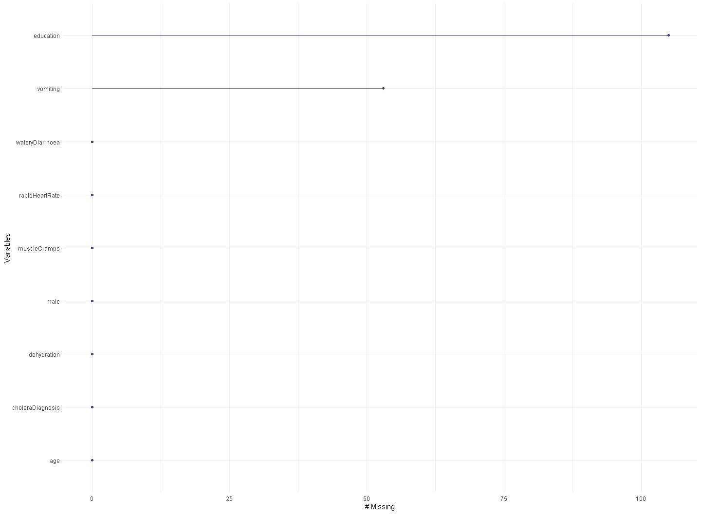
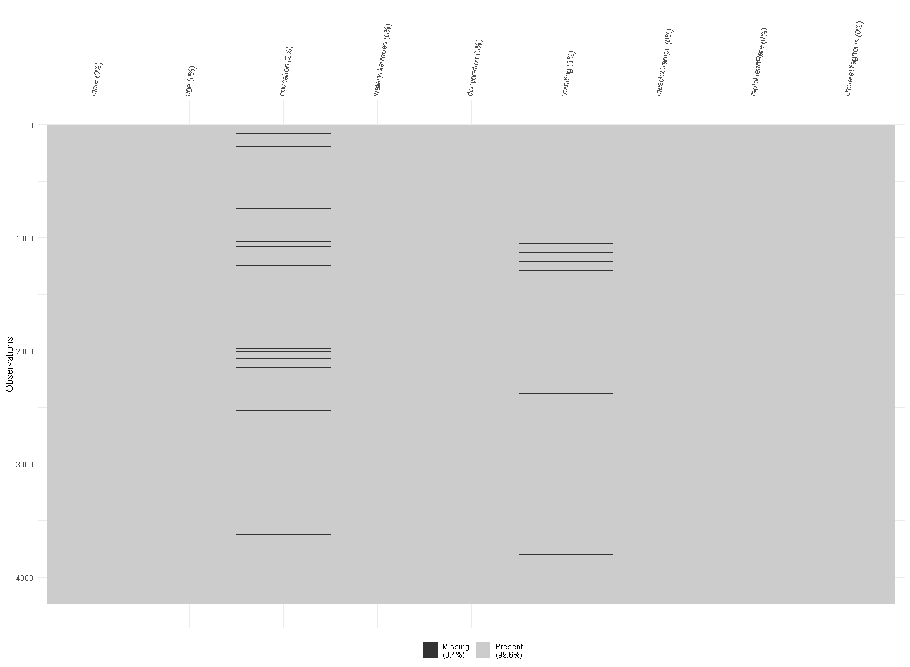
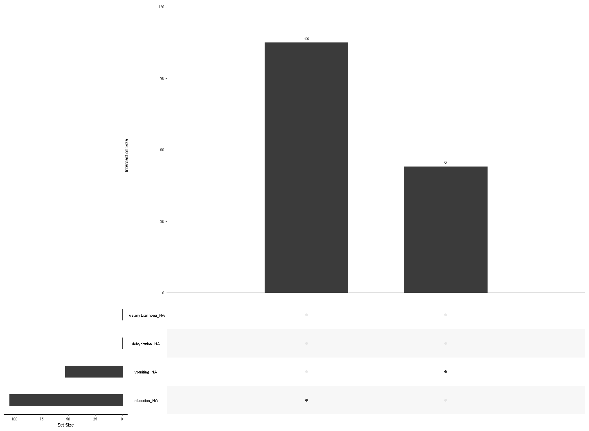
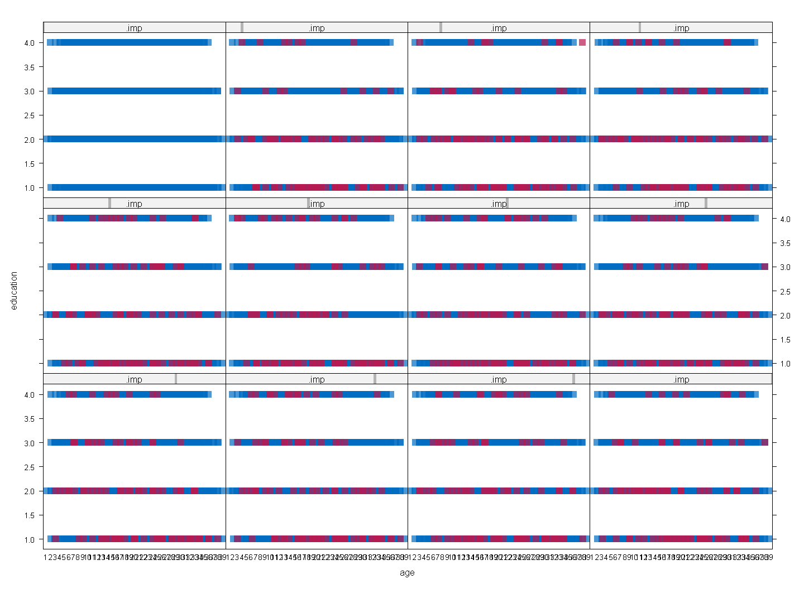
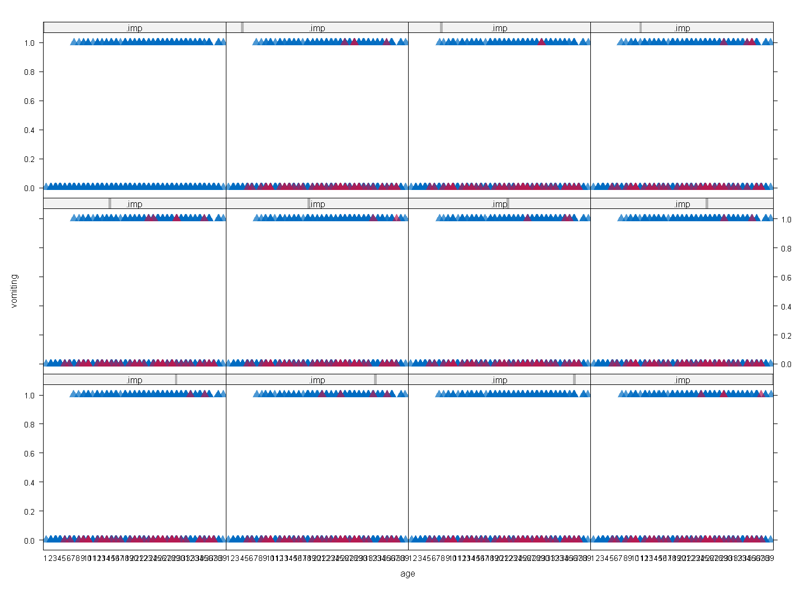
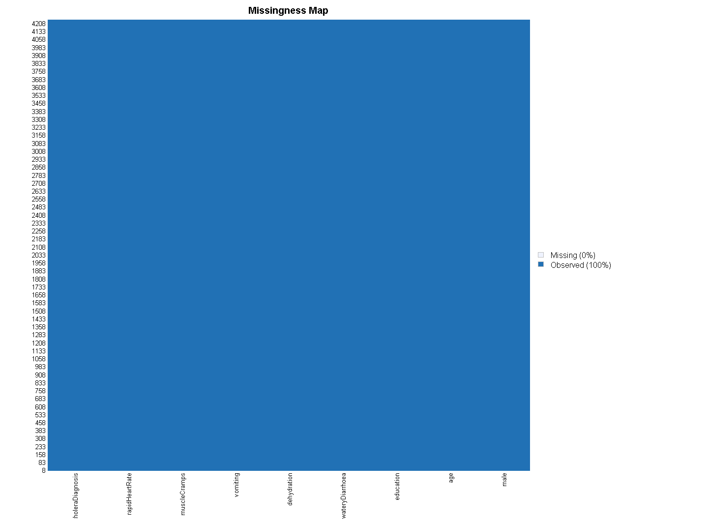
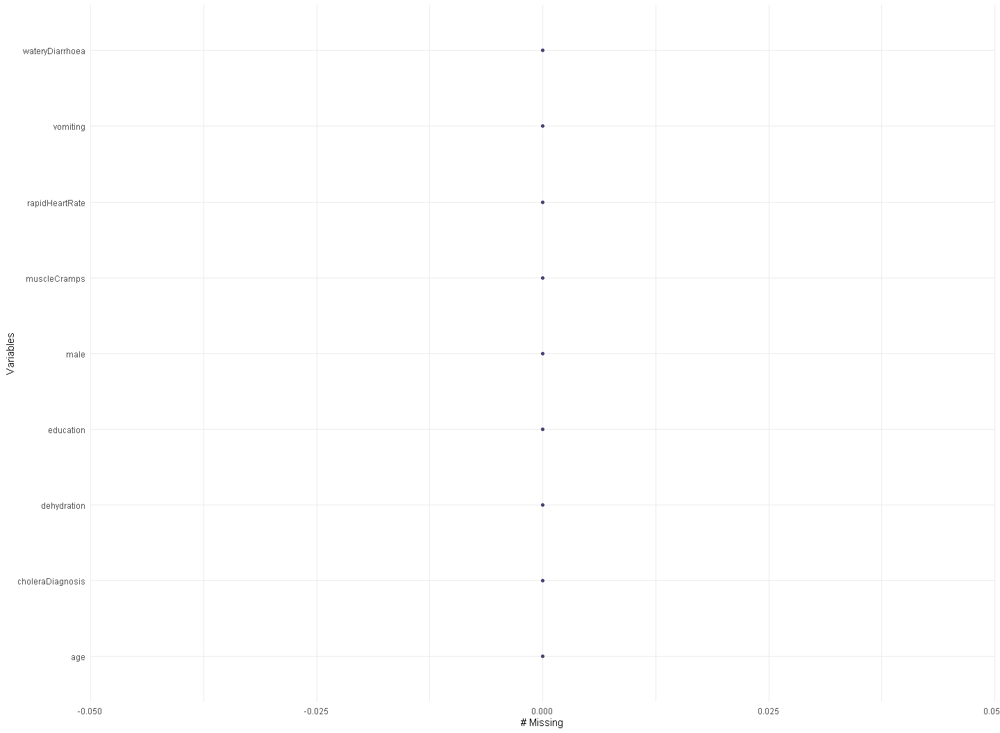
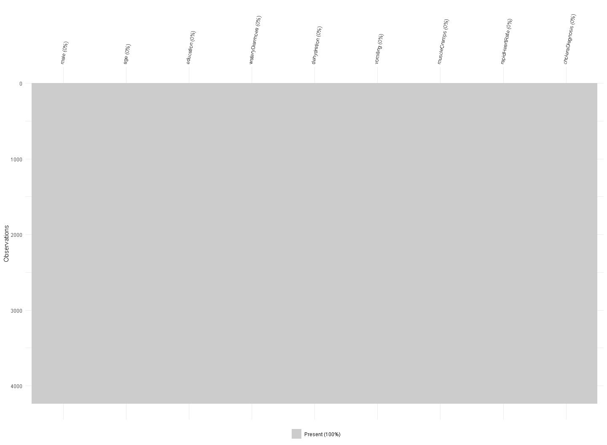
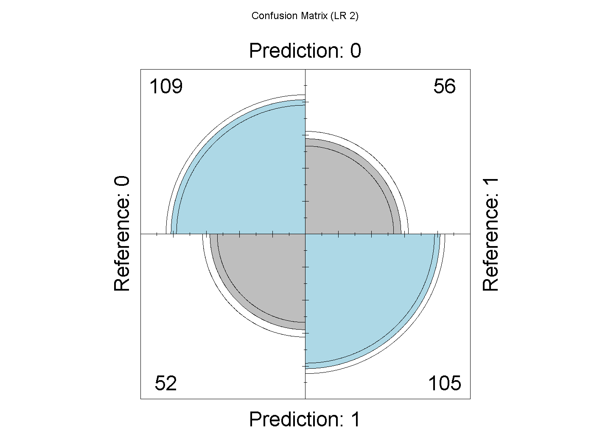

Cholera Classification Model Project
================
Hakeem Alavi
30/10/2023

- [Student Details](#student-details)
- [Setup Chunk](#setup-chunk)
- [Classification Problem](#classification-problem)
- [STEP 1. Install and Load the Required
  Packages](#step-1-install-and-load-the-required-packages)
- [STEP 2. Load and pre-process the
  dataset](#step-2-load-and-pre-process-the-dataset)
- [STEP 3. Dataset splitting](#step-3-dataset-splitting)
- [STEP 4. Model creation](#step-4-model-creation)
- [STEP 5. Visualize the results](#step-5-visualize-the-results)

# Student Details

|                       |              |
|-----------------------|--------------|
| **Student ID Number** | 134775       |
| **Student Name**      | Hakeem Alavi |
| **BBIT 4.2 Group**    | C            |

# Setup Chunk

**Note:** the following KnitR options have been set as the global
defaults: <BR>
`knitr::opts_chunk$set(echo = TRUE, warning = FALSE, eval = TRUE, collapse = FALSE, tidy = TRUE)`.

More KnitR options are documented here
<https://bookdown.org/yihui/rmarkdown-cookbook/chunk-options.html> and
here <https://yihui.org/knitr/options/>.

# Classification Problem

# STEP 1. Install and Load the Required Packages

``` r
if (!is.element("dplyr", installed.packages()[, 1])) {
  install.packages("dplyr", dependencies = TRUE,
                   repos = "https://cloud.r-project.org")
}
require("dplyr")
```

    ## Loading required package: dplyr

    ## 
    ## Attaching package: 'dplyr'

    ## The following objects are masked from 'package:stats':
    ## 
    ##     filter, lag

    ## The following objects are masked from 'package:base':
    ## 
    ##     intersect, setdiff, setequal, union

``` r
if (!is.element("naniar", installed.packages()[, 1])) {
  install.packages("naniar", dependencies = TRUE,
                   repos = "https://cloud.r-project.org")
}
require("naniar")
```

    ## Loading required package: naniar

``` r
if (!is.element("ggplot2", installed.packages()[, 1])) {
  install.packages("ggplot2", dependencies = TRUE,
                   repos = "https://cloud.r-project.org")
}
require("ggplot2")
```

    ## Loading required package: ggplot2

``` r
# We use the MICE package to perform data imputation

if (!is.element("mice", installed.packages()[, 1])) {
  install.packages("mice", dependencies = TRUE,
                   repos = "https://cloud.r-project.org")
}
require("mice")
```

    ## Loading required package: mice

    ## 
    ## Attaching package: 'mice'

    ## The following object is masked from 'package:stats':
    ## 
    ##     filter

    ## The following objects are masked from 'package:base':
    ## 
    ##     cbind, rbind

``` r
if (!is.element("Amelia", installed.packages()[, 1])) {
  install.packages("Amelia", dependencies = TRUE,
                   repos = "https://cloud.r-project.org")
}
require("Amelia")
```

    ## Loading required package: Amelia

    ## Loading required package: Rcpp

    ## ## 
    ## ## Amelia II: Multiple Imputation
    ## ## (Version 1.8.1, built: 2022-11-18)
    ## ## Copyright (C) 2005-2023 James Honaker, Gary King and Matthew Blackwell
    ## ## Refer to http://gking.harvard.edu/amelia/ for more information
    ## ##

``` r
if (require("caret")) {
  require("caret")
} else {
  install.packages("caret", dependencies = TRUE,
                   repos = "https://cloud.r-project.org")
}
```

    ## Loading required package: caret

    ## Loading required package: lattice

``` r
if (require("mlbench")) {
  require("mlbench")
} else {
  install.packages("mlbench", dependencies = TRUE,
                   repos = "https://cloud.r-project.org")
}
```

    ## Loading required package: mlbench

``` r
if (require("pROC")) {
  require("pROC")
} else {
  install.packages("pROC", dependencies = TRUE,
                   repos = "https://cloud.r-project.org")
}
```

    ## Loading required package: pROC

    ## Type 'citation("pROC")' for a citation.

    ## 
    ## Attaching package: 'pROC'

    ## The following objects are masked from 'package:stats':
    ## 
    ##     cov, smooth, var

``` r
if (require("stats")) {
  require("stats")
} else {
  install.packages("stats", dependencies = TRUE,
                   repos = "https://cloud.r-project.org")
}


## caret ----
if (require("caret")) {
  require("caret")
} else {
  install.packages("caret", dependencies = TRUE,
                   repos = "https://cloud.r-project.org")
}

## MASS ----
if (require("MASS")) {
  require("MASS")
} else {
  install.packages("MASS", dependencies = TRUE,
                   repos = "https://cloud.r-project.org")
}
```

    ## Loading required package: MASS

    ## 
    ## Attaching package: 'MASS'

    ## The following object is masked from 'package:dplyr':
    ## 
    ##     select

``` r
## glmnet ----
if (require("glmnet")) {
  require("glmnet")
} else {
  install.packages("glmnet", dependencies = TRUE,
                   repos = "https://cloud.r-project.org")
}
```

    ## Loading required package: glmnet

    ## Loading required package: Matrix

    ## Loaded glmnet 4.1-8

``` r
## e1071 ----
if (require("e1071")) {
  require("e1071")
} else {
  install.packages("e1071", dependencies = TRUE,
                   repos = "https://cloud.r-project.org")
}
```

    ## Loading required package: e1071

``` r
## kernlab ----
if (require("kernlab")) {
  require("kernlab")
} else {
  install.packages("kernlab", dependencies = TRUE,
                   repos = "https://cloud.r-project.org")
}
```

    ## Loading required package: kernlab

    ## 
    ## Attaching package: 'kernlab'

    ## The following object is masked from 'package:mice':
    ## 
    ##     convergence

    ## The following object is masked from 'package:ggplot2':
    ## 
    ##     alpha

``` r
## rpart ----
if (require("rpart")) {
  require("rpart")
} else {
  install.packages("rpart", dependencies = TRUE,
                   repos = "https://cloud.r-project.org")
}
```

    ## Loading required package: rpart

# STEP 2. Load and pre-process the dataset

``` r
# Importing Dataset ----

library(readr)
cholera <- read_csv("data/cholera.csv")
```

    ## Rows: 4238 Columns: 9
    ## ── Column specification ────────────────────────────────────────────────────────
    ## Delimiter: ","
    ## dbl (9): male, age, education, wateryDiarrhoea, dehydration, vomiting, muscl...
    ## 
    ## ℹ Use `spec()` to retrieve the full column specification for this data.
    ## ℹ Specify the column types or set `show_col_types = FALSE` to quiet this message.

``` r
### Confirm the "missingness" in the Dataset before Imputation ----
# Are there missing values in the dataset?

any_na(cholera)
```

    ## [1] TRUE

``` r
# How many?

n_miss(cholera)
```

    ## [1] 158

``` r
# What is the percentage of missing data in the entire dataset?

prop_miss(cholera)
```

    ## [1] 0.004142415

``` r
# How many missing values does each variable have?

cholera %>% is.na() %>% colSums()
```

    ##             male              age        education  wateryDiarrhoea 
    ##                0                0              105                0 
    ##      dehydration         vomiting     muscleCramps   rapidHeartRate 
    ##                0               53                0                0 
    ## choleraDiagnosis 
    ##                0

``` r
# What is the number and percentage of missing values grouped by
# each variable?

miss_var_summary(cholera)
```

    ## # A tibble: 9 × 3
    ##   variable         n_miss pct_miss
    ##   <chr>             <int>    <dbl>
    ## 1 education           105     2.48
    ## 2 vomiting             53     1.25
    ## 3 male                  0     0   
    ## 4 age                   0     0   
    ## 5 wateryDiarrhoea       0     0   
    ## 6 dehydration           0     0   
    ## 7 muscleCramps          0     0   
    ## 8 rapidHeartRate        0     0   
    ## 9 choleraDiagnosis      0     0

``` r
# What is the number and percentage of missing values grouped by
# each observation?

miss_case_summary(cholera)
```

    ## # A tibble: 4,238 × 3
    ##     case n_miss pct_miss
    ##    <int>  <int>    <dbl>
    ##  1    34      1     11.1
    ##  2    37      1     11.1
    ##  3    50      1     11.1
    ##  4    73      1     11.1
    ##  5    78      1     11.1
    ##  6   185      1     11.1
    ##  7   194      1     11.1
    ##  8   214      1     11.1
    ##  9   246      1     11.1
    ## 10   294      1     11.1
    ## # ℹ 4,228 more rows

``` r
# Which variables contain the most missing values?

gg_miss_var(cholera)
```

<!-- -->

``` r
# Where are missing values located (the shaded regions in the plot)?

vis_miss(cholera) + theme(axis.text.x = element_text(angle = 80))
```

<!-- -->

``` r
# Which combinations of variables are missing together?

gg_miss_upset(cholera)
```

    ## `geom_line()`: Each group consists of only one observation.
    ## ℹ Do you need to adjust the group aesthetic?

<!-- -->

``` r
# Assuming cholera is your dataset

library(mice)

# Create an empty predictor matrix

predictorMatrix <- matrix(0, ncol = ncol(cholera), nrow = ncol(cholera), 
                          dimnames = list(names(cholera), names(cholera)))

# Specify the imputation methods for the 'education' and 'vomiting' columns

predictorMatrix['education', ] <- "polr"
predictorMatrix['vomiting', ] <- "logreg"

# Run mice with the specified imputation methods

cholera_mice <- mice(cholera, m = 11, method = 'pmm', seed = 7, predictorMatrix = predictorMatrix)
```

    ## 
    ##  iter imp variable
    ##   1   1  education  vomiting
    ##   1   2  education  vomiting
    ##   1   3  education  vomiting
    ##   1   4  education  vomiting
    ##   1   5  education  vomiting
    ##   1   6  education  vomiting
    ##   1   7  education  vomiting
    ##   1   8  education  vomiting
    ##   1   9  education  vomiting
    ##   1   10  education  vomiting
    ##   1   11  education  vomiting
    ##   2   1  education  vomiting
    ##   2   2  education  vomiting
    ##   2   3  education  vomiting
    ##   2   4  education  vomiting
    ##   2   5  education  vomiting
    ##   2   6  education  vomiting
    ##   2   7  education  vomiting
    ##   2   8  education  vomiting
    ##   2   9  education  vomiting
    ##   2   10  education  vomiting
    ##   2   11  education  vomiting
    ##   3   1  education  vomiting
    ##   3   2  education  vomiting
    ##   3   3  education  vomiting
    ##   3   4  education  vomiting
    ##   3   5  education  vomiting
    ##   3   6  education  vomiting
    ##   3   7  education  vomiting
    ##   3   8  education  vomiting
    ##   3   9  education  vomiting
    ##   3   10  education  vomiting
    ##   3   11  education  vomiting
    ##   4   1  education  vomiting
    ##   4   2  education  vomiting
    ##   4   3  education  vomiting
    ##   4   4  education  vomiting
    ##   4   5  education  vomiting
    ##   4   6  education  vomiting
    ##   4   7  education  vomiting
    ##   4   8  education  vomiting
    ##   4   9  education  vomiting
    ##   4   10  education  vomiting
    ##   4   11  education  vomiting
    ##   5   1  education  vomiting
    ##   5   2  education  vomiting
    ##   5   3  education  vomiting
    ##   5   4  education  vomiting
    ##   5   5  education  vomiting
    ##   5   6  education  vomiting
    ##   5   7  education  vomiting
    ##   5   8  education  vomiting
    ##   5   9  education  vomiting
    ##   5   10  education  vomiting
    ##   5   11  education  vomiting

``` r
# We can use multiple scatter plots (a.k.a. strip-plots) to visualize how
# random the imputed data is in each of the 11 datasets.

# For education, which is a categorical variable

stripplot(cholera_mice,
          education ~ age | .imp,
          pch = 15, cex = 1.5)
```

<!-- -->

``` r
# For vomiting, which is a binary variable

stripplot(cholera_mice,
          vomiting ~ age | .imp,
          pch = 17, cex = 1.5)
```

<!-- -->

``` r
### Impute the missing data ----

cholera_imputed <- mice::complete(cholera_mice, 1)

### Confirm the "missingness" in the Imputed Dataset ----
# A textual confirmation that the dataset has no more missing values in any
# feature:

miss_var_summary(cholera_imputed)
```

    ## # A tibble: 9 × 3
    ##   variable         n_miss pct_miss
    ##   <chr>             <int>    <dbl>
    ## 1 male                  0        0
    ## 2 age                   0        0
    ## 3 education             0        0
    ## 4 wateryDiarrhoea       0        0
    ## 5 dehydration           0        0
    ## 6 vomiting              0        0
    ## 7 muscleCramps          0        0
    ## 8 rapidHeartRate        0        0
    ## 9 choleraDiagnosis      0        0

``` r
# A visual confirmation that the dataset has no more missing values in any
# feature:

Amelia::missmap(cholera_imputed)
```

<!-- -->

``` r
# Are there missing values in the dataset?

any_na(cholera_imputed)
```

    ## [1] FALSE

``` r
# How many?

n_miss(cholera_imputed)
```

    ## [1] 0

``` r
# What is the percentage of missing data in the entire dataset?

prop_miss(cholera_imputed)
```

    ## [1] 0

``` r
# How many missing values does each variable have?

cholera_imputed %>% is.na() %>% colSums()
```

    ##             male              age        education  wateryDiarrhoea 
    ##                0                0                0                0 
    ##      dehydration         vomiting     muscleCramps   rapidHeartRate 
    ##                0                0                0                0 
    ## choleraDiagnosis 
    ##                0

``` r
# What is the number and percentage of missing values grouped by
# each variable?

miss_var_summary(cholera_imputed)
```

    ## # A tibble: 9 × 3
    ##   variable         n_miss pct_miss
    ##   <chr>             <int>    <dbl>
    ## 1 male                  0        0
    ## 2 age                   0        0
    ## 3 education             0        0
    ## 4 wateryDiarrhoea       0        0
    ## 5 dehydration           0        0
    ## 6 vomiting              0        0
    ## 7 muscleCramps          0        0
    ## 8 rapidHeartRate        0        0
    ## 9 choleraDiagnosis      0        0

``` r
# What is the number and percentage of missing values grouped by
# each observation?

miss_case_summary(cholera_imputed)
```

    ## # A tibble: 4,238 × 3
    ##     case n_miss pct_miss
    ##    <int>  <int>    <dbl>
    ##  1     1      0        0
    ##  2     2      0        0
    ##  3     3      0        0
    ##  4     4      0        0
    ##  5     5      0        0
    ##  6     6      0        0
    ##  7     7      0        0
    ##  8     8      0        0
    ##  9     9      0        0
    ## 10    10      0        0
    ## # ℹ 4,228 more rows

``` r
# Which variables contain the most missing values?

gg_miss_var(cholera_imputed)
```

<!-- -->

``` r
# We require the "ggplot2" package to create more appealing visualizations
# Where are missing values located (the shaded regions in the plot)?

vis_miss(cholera_imputed) + theme(axis.text.x = element_text(angle = 80))
```

<!-- -->

``` r
## Undersampling ----
# Load the necessary libraries

library(caret)

# Convert 'choleraDiagnosis' to a factor

cholera_imputed$choleraDiagnosis <- as.factor(cholera_imputed$choleraDiagnosis)

# Identify the positive and negative class samples

positive_samples <- cholera_imputed[cholera_imputed$choleraDiagnosis == 1, ]
negative_samples <- cholera_imputed[cholera_imputed$choleraDiagnosis == 0, ]

# Undersample the majority class (in this case, the negative class)

negative_samples_undersampled <- negative_samples[sample(nrow(negative_samples), nrow(positive_samples)), ]

# Combine the undersampled negative class with the positive class

cholera_undersampled <- rbind(negative_samples_undersampled, positive_samples)

# Check the class distribution after applying undersampling

table(cholera_undersampled$choleraDiagnosis)
```

    ## 
    ##   0   1 
    ## 644 644

``` r
# Conclusion: The class distribution is now balanced after performing undersampling

# This balance in the number of instances for each class will help mitigate the

# effects of class imbalance and ensure that your logistic regression model can

# learn from both classes effectively, leading to more accurate predictions and

# improved model performance.

# Initial Data Analysis

summary(cholera_undersampled)
```

    ##       male             age          education    wateryDiarrhoea 
    ##  Min.   :0.0000   Min.   :32.00   Min.   :1.00   Min.   :0.0000  
    ##  1st Qu.:0.0000   1st Qu.:44.00   1st Qu.:1.00   1st Qu.:0.0000  
    ##  Median :0.0000   Median :51.00   Median :2.00   Median :1.0000  
    ##  Mean   :0.4666   Mean   :51.37   Mean   :1.92   Mean   :0.5132  
    ##  3rd Qu.:1.0000   3rd Qu.:58.00   3rd Qu.:3.00   3rd Qu.:1.0000  
    ##  Max.   :1.0000   Max.   :70.00   Max.   :4.00   Max.   :1.0000  
    ##   dehydration        vomiting        muscleCramps    rapidHeartRate   
    ##  Min.   :0.0000   Min.   :0.00000   Min.   :0.0000   Min.   :0.00000  
    ##  1st Qu.:0.0000   1st Qu.:0.00000   1st Qu.:0.0000   1st Qu.:0.00000  
    ##  Median :0.0000   Median :0.00000   Median :0.0000   Median :0.00000  
    ##  Mean   :0.3936   Mean   :0.04193   Mean   :0.0396   Mean   :0.01009  
    ##  3rd Qu.:1.0000   3rd Qu.:0.00000   3rd Qu.:0.0000   3rd Qu.:0.00000  
    ##  Max.   :1.0000   Max.   :1.00000   Max.   :1.0000   Max.   :1.00000  
    ##  choleraDiagnosis
    ##  0:644           
    ##  1:644           
    ##                  
    ##                  
    ##                  
    ## 

# STEP 3. Dataset splitting

``` r
## Dataset Splitting ----
# Define a 75:25 train:test data split of the dataset.
# That is, 75% of the original data will be used to train the model and
# 25% of the original data will be used to test the model.

train_index <- createDataPartition(cholera_undersampled$choleraDiagnosis,
                                   p = 0.75,
                                   list = FALSE)
cholera_train <- cholera_undersampled[train_index, ]
cholera_test <- cholera_undersampled[-train_index, ]

library(caret)

# 5-fold cross-validation

train_control <- trainControl(method = "cv", number = 5)
```

# STEP 4. Model creation

``` r
## Logistic Regression 2 ----
# We can use "glmnet" 

set.seed(7)
cholera_caret_model_logistic_two <- train(
  choleraDiagnosis ~ ., 
  data = cholera_train,
  method = "glmnet",
  family = "binomial",
  metric = "Accuracy",
  preProcess = c("center", "scale"),
  trControl = trainControl(method = "cv", number = 5, verboseIter = TRUE),
  maxit = 1000
)
```

    ## + Fold1: alpha=0.10, lambda=0.03216 
    ## - Fold1: alpha=0.10, lambda=0.03216 
    ## + Fold1: alpha=0.55, lambda=0.03216 
    ## - Fold1: alpha=0.55, lambda=0.03216 
    ## + Fold1: alpha=1.00, lambda=0.03216 
    ## - Fold1: alpha=1.00, lambda=0.03216 
    ## + Fold2: alpha=0.10, lambda=0.03216 
    ## - Fold2: alpha=0.10, lambda=0.03216 
    ## + Fold2: alpha=0.55, lambda=0.03216 
    ## - Fold2: alpha=0.55, lambda=0.03216 
    ## + Fold2: alpha=1.00, lambda=0.03216 
    ## - Fold2: alpha=1.00, lambda=0.03216 
    ## + Fold3: alpha=0.10, lambda=0.03216 
    ## - Fold3: alpha=0.10, lambda=0.03216 
    ## + Fold3: alpha=0.55, lambda=0.03216 
    ## - Fold3: alpha=0.55, lambda=0.03216 
    ## + Fold3: alpha=1.00, lambda=0.03216 
    ## - Fold3: alpha=1.00, lambda=0.03216 
    ## + Fold4: alpha=0.10, lambda=0.03216 
    ## - Fold4: alpha=0.10, lambda=0.03216 
    ## + Fold4: alpha=0.55, lambda=0.03216 
    ## - Fold4: alpha=0.55, lambda=0.03216 
    ## + Fold4: alpha=1.00, lambda=0.03216 
    ## - Fold4: alpha=1.00, lambda=0.03216 
    ## + Fold5: alpha=0.10, lambda=0.03216 
    ## - Fold5: alpha=0.10, lambda=0.03216 
    ## + Fold5: alpha=0.55, lambda=0.03216 
    ## - Fold5: alpha=0.55, lambda=0.03216 
    ## + Fold5: alpha=1.00, lambda=0.03216 
    ## - Fold5: alpha=1.00, lambda=0.03216 
    ## Aggregating results
    ## Selecting tuning parameters
    ## Fitting alpha = 0.1, lambda = 0.00322 on full training set

``` r
# Check for multicollinearity
findLinearCombos(cholera_train[, -which(names(cholera_train) %in% "choleraDiagnosis")])
```

    ## $linearCombos
    ## list()
    ## 
    ## $remove
    ## NULL

``` r
print(cholera_caret_model_logistic_two)
```

    ## glmnet 
    ## 
    ## 966 samples
    ##   8 predictor
    ##   2 classes: '0', '1' 
    ## 
    ## Pre-processing: centered (8), scaled (8) 
    ## Resampling: Cross-Validated (5 fold) 
    ## Summary of sample sizes: 773, 772, 772, 774, 773 
    ## Resampling results across tuning parameters:
    ## 
    ##   alpha  lambda        Accuracy   Kappa    
    ##   0.10   0.0003216258  0.6760129  0.3519093
    ##   0.10   0.0032162584  0.6760129  0.3519093
    ##   0.10   0.0321625844  0.6708529  0.3415681
    ##   0.55   0.0003216258  0.6760129  0.3519093
    ##   0.55   0.0032162584  0.6749712  0.3498260
    ##   0.55   0.0321625844  0.6677656  0.3353646
    ##   1.00   0.0003216258  0.6760129  0.3519093
    ##   1.00   0.0032162584  0.6729041  0.3456672
    ##   1.00   0.0321625844  0.6584713  0.3168085
    ## 
    ## Accuracy was used to select the optimal model using the largest value.
    ## The final values used for the model were alpha = 0.1 and lambda = 0.003216258.

``` r
### Calculating Metrics ----
# Make predictions

cholera_predictions_lr_two <- predict(cholera_caret_model_logistic_two,
                                  cholera_test)

# Display the model's evaluation metrics 

cholera_confusion_matrix_lr_two <-
  caret::confusionMatrix(cholera_predictions_lr_two,
                         cholera_test$choleraDiagnosis)
print(cholera_confusion_matrix_lr_two)
```

    ## Confusion Matrix and Statistics
    ## 
    ##           Reference
    ## Prediction   0   1
    ##          0 109  56
    ##          1  52 105
    ##                                          
    ##                Accuracy : 0.6646         
    ##                  95% CI : (0.6101, 0.716)
    ##     No Information Rate : 0.5            
    ##     P-Value [Acc > NIR] : 1.776e-09      
    ##                                          
    ##                   Kappa : 0.3292         
    ##                                          
    ##  Mcnemar's Test P-Value : 0.7728         
    ##                                          
    ##             Sensitivity : 0.6770         
    ##             Specificity : 0.6522         
    ##          Pos Pred Value : 0.6606         
    ##          Neg Pred Value : 0.6688         
    ##              Prevalence : 0.5000         
    ##          Detection Rate : 0.3385         
    ##    Detection Prevalence : 0.5124         
    ##       Balanced Accuracy : 0.6646         
    ##                                          
    ##        'Positive' Class : 0              
    ## 

# STEP 5. Visualize the results

``` r
### Confusion Matrix ----

fourfoldplot(as.table(cholera_confusion_matrix_lr_two), color = c("grey", "lightblue"),
             main = "Confusion Matrix (LR 2)") 
```

<!-- -->
